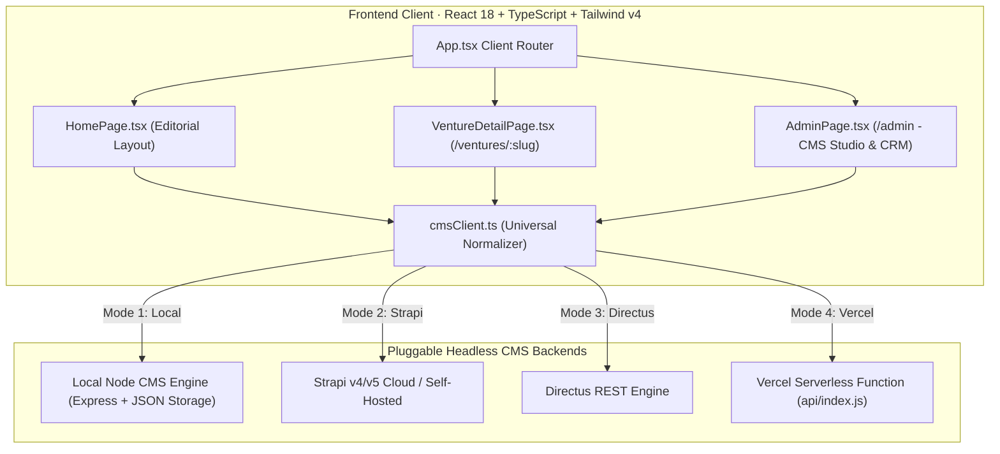

# Techdome Venture Studio — Enterprise Architecture & Full-Stack CMS Guide

An enterprise-ready, production-grade web application and decoupled Headless CMS built for **Techdome Venture Studio** (Hyderabad). 

Built with **React 18 (TypeScript), Tailwind CSS v4, Lucide Icons**, clean **Plus Jakarta Sans & Inter** typography, and a **Universal Headless CMS Architecture** that switches seamlessly between our local Node CMS engine, **Strapi v4/v5**, or **Directus** in one line of configuration.

---

## ⚡ Quickstart & Localhost Demo

```bash
# 1. Install dependencies
npm install

# 2. Start both Headless CMS (port 1337) and Frontend (port 3000) concurrently
npm run dev
```

* **Frontend Public Studio:** [http://localhost:3000](http://localhost:3000)
* **Protected CMS Studio & Lead CRM:** [http://localhost:3000/admin](http://localhost:3000/admin) *(Access Key: `Techdome`)*
* **Headless REST API:** [http://localhost:1337/api/ventures](http://localhost:1337/api/ventures)

---

## 🔄 1-Line CMS Provider Switcher (Local Engine ⇄ Strapi ⇄ Directus)

Our frontend includes a **Universal Headless CMS Normalizer** in [`frontend/src/api/cmsClient.ts`](frontend/src/api/cmsClient.ts). You can point the frontend to **ANY backend** without changing a single line of React code!

### Mode 1: Local Built-in Node CMS (Default)
No configuration needed. Runs locally on port 1337 with zero dependencies:
```env
# frontend/.env (or leave default)
VITE_CMS_URL=http://localhost:1337
```

### Mode 2: Live Strapi v4 / v5 (Local or Strapi Cloud)
Point the frontend to your Strapi instance and provide an API token:
```env
# frontend/.env
VITE_CMS_URL=https://your-strapi-app.strapiapp.com
VITE_CMS_TOKEN=your_strapi_api_token
```
*The normalizer automatically unwraps Strapi's nested `{ data: [{ id, attributes: { ... } }] }` or Strapi v5 flat document structure into unified TypeScript types!*

### Mode 3: Unified All-in-One Vercel Deployment
Deploy both frontend and serverless REST CMS together on Vercel:
```env
# Runs relative to current domain
VITE_CMS_URL=
```

---

## 🏛️ System Architecture Diagram



---

## 🧩 Component Hierarchy & Flow Breakdown

```
App.tsx (Root State Hydration, Dynamic Routing & Cross-Route Scroll Management)
│
├── Header.tsx (Sticky Studio Navbar, Navigation Links, Direct Consultation Trigger)
│
├── [Route: /] HomePage.tsx (Editorial Studio View)
│   ├── Hero.tsx (Dynamic Headline, Subline, Eyebrow, 4 Business Impact Metrics)
│   ├── StudioServices.tsx (4 Practice Areas · 2-Card Desktop / 1-Card Mobile Loop-Back Carousel)
│   ├── VentureCard.tsx (Portfolio Ventures · Stage Filter Bar + Side-End Nav Carousel)
│   ├── StageTracker.tsx (Venture Lifecycle Framework · Phase 01/02/03 Gates + Compact Cohort Pills)
│   ├── EngagementModels.tsx (4 Commercial Partnership Tiers · Venture Co-Founding to Pods)
│   ├── Manifesto Section (Dynamic Studio Philosophy Quote)
│   └── ContactSection.tsx (Open In-Page Consultation Form · Direct CMS Lead Submission)
│
├── [Route: /ventures/:slug] VentureDetailPage.tsx (Structured Case Study)
│   ├── Breadcrumb Bar (Back Navigation + Route Path + Quick CMS Edit Trigger)
│   ├── Hero Header (Category Eyebrow, Title, Stage Badge, Cohort Year, Full One-Liner)
│   ├── 16:9 Architectural Banner Canvas
│   ├── 4-Column Key Metrics Grid (Zero Truncation: Capital, Lifecycle, Founders, Cohort)
│   ├── Production Tech Stack Badges (TypeScript, Python, AWS, PyTorch, Kubernetes)
│   ├── Deep-Dive Case Study & Market Thesis Narrative
│   └── Schedule Discovery Call Trigger (Smooth-scrolls cross-route to /#contact)
│
├── [Route: /admin] AdminPage.tsx (Enterprise White-Theme CMS Studio & CRM)
│   ├── Tab 1: Ventures Model (High-density table list, Live/Draft toggles, Full Editor Modal)
│   ├── Tab 2: Client Inquiries CRM (Lead tracker, Status dropdowns: New -> Contacted -> Closed)
│   ├── Tab 3: Services & Models (Live editable Practice Areas & 4 Engagement Pricing Tiers)
│   ├── Tab 4: Global Settings (Hero copy, 4 impact metrics, and manifesto quotes)
│   └── Tab 5: REST API Explorer (Interactive JSON endpoint inspector)
│
└── Footer.tsx (Studio Details, Navigation Links, Admin Studio Entry)
```

---

## 💼 The 4 Practice Areas vs. 4 Engagement Models Strategy

| # | Practice Area (*"How We Build"*) | Engagement Model (*"How We Partner & Bill"*) | Target Profile | Commercial Terms |
|---|---|---|---|---|
| **1** | **Venture Co-Founding** | **Venture Equity Co-Founding** | Visionary domain founders seeking an institutional technical co-founder. | Sweat Equity (15%–30%) + Shared Risk to Series A. |
| **2** | **Rapid 14-Day MVP Discovery** | **Rapid 14-Day MVP Sprint** | Early-stage founders validating demand before heavy code. | Fixed Timeline (14 Days) & Fixed Scope ($15k–$30k). |
| **3** | **Enterprise AI & Cloud Foundry** | **Enterprise AI & Cloud Sprints** | Enterprise leaders & startups deploying private LLMs & agents. | Milestone Sprints ($35k–$75k per milestone). |
| **4** | **Dedicated Engineering Pods** | **Dedicated Pod Retainer** | Scaling growth companies needing senior dedicated teams. | Monthly Retainer (2–8 developers, quarterly rolling). |

---

## 📦 Data Collections & Pre-Configured Strapi Schemas

All schema definitions are exportable and ready to import in [`cms/strapi-schema/`](cms/strapi-schema/):

1. **`ventures.json`** — Full case studies with stage enum (`Building` | `Launched` | `Exited`), tech stack chips, traction metrics, and draft/publish controls.
2. **`globals.json`** — Studio copy, hero positioning, manifesto quotes, and 4 core business metrics.
3. **`services.json`** — 4 studio practice areas ("How We Build").
4. **`engagement-models.json`** — 4 commercial partnership tiers ("Pricing & Partnership").
5. **`inquiries.json`** — Lead capture CRM storing discovery call and pitch requests with status tracking.

---

## 🛠️ Complete Headless REST API Endpoints

| Method | Endpoint | Description |
|---|---|---|
| `GET` | `/api/ventures` | Returns published portfolio ventures (supports `?stage=` and `?drafts=true`) |
| `GET` | `/api/ventures/:slug` | Retrieves single venture case study by slug or ID |
| `POST` | `/api/ventures` | Creates a new venture record with atomic persistence |
| `PUT` | `/api/ventures/:id` | Updates venture fields (used during live Acid Test) |
| `DELETE` | `/api/ventures/:id` | Deletes venture by ID |
| `GET` | `/api/services` | Retrieves 4 studio capabilities & deliverables |
| `PUT` | `/api/services/:id` | Updates practice area title, tagline, description, deliverables |
| `GET` | `/api/engagement-models`| Retrieves 4 partnership & pricing tiers |
| `PUT` | `/api/engagement-models/:id` | Updates model title, pricing badge, description, features |
| `POST` | `/api/inquiries` | Public lead capture endpoint for discovery calls & venture pitches |
| `GET` | `/api/inquiries` | Retrieves all client leads (supports `?status=new|contacted|in_review|closed`) |
| `PUT` | `/api/inquiries/:id` | Updates lead status & internal notes |
| `DELETE` | `/api/inquiries/:id` | Deletes spam / closed inquiry |
| `GET` | `/api/globals` | Retrieves studio hero statements, metrics, and manifesto |
| `PUT` | `/api/globals` | Updates global statements and metrics |
| `GET` | `/api/health` | Uptime, version, and database record health |
| `POST` | `/api/reset` | Resets content store back to default seed data |

---

## 💡 Technical Decisions & Architecture FAQs

### Why Strapi over SaaS CMS platforms (Contentful / Sanity)?
> **Data Ownership & Cost:** Strapi provides complete data ownership within our own cloud perimeter (AWS/VPC) with zero per-seat licensing fees or API call caps. Its open-source Node.js TypeScript foundation, native Draft/Publish RBAC workflows, and auto-generated REST/GraphQL APIs match our venture data models seamlessly.

### CMS Downtime Resilience & Error Handling
> **Graceful Degradation:** All network requests in `src/api/cmsClient.ts` are wrapped in structured `CmsApiError` handling. If the CMS service experiences downtime or network latency, the frontend avoids unhandled blank screen crashes by rendering an informative diagnostic `CmsErrorBanner` with an instant retry trigger.

### Content Lifecycle & Draft/Publish Architecture
> **Editorial Control:** Every venture model includes a boolean `published` property. Public-facing routes (`GET /api/ventures`) filter out draft items by default, while authenticated studio partners can toggle items between Live and Draft states with atomic persistence via the CMS Admin interface.

### Architectural Scope & Trade-offs
> **Deliberate Prioritization:** Auth and cloud storage were scoped to lightweight session keys and CDN-hosted media to maximize focus on the core requirements: an editorial design system, 100% dynamic CMS wiring, zero hardcoded content, responsive layouts, and an interactive lead capture CRM.